% Extending Landsat's Record: Integrating Landsat 8 OLI Measurements into TM/ETM+ Timeseries Analysis
% Chris Holden
% November 20, 2015

# Landsat

## Characteristics

- 30m passive optical with 16-day repeat
- Consistency in nature of observations
- Living witness to 40 years of global change
- Freely available

##
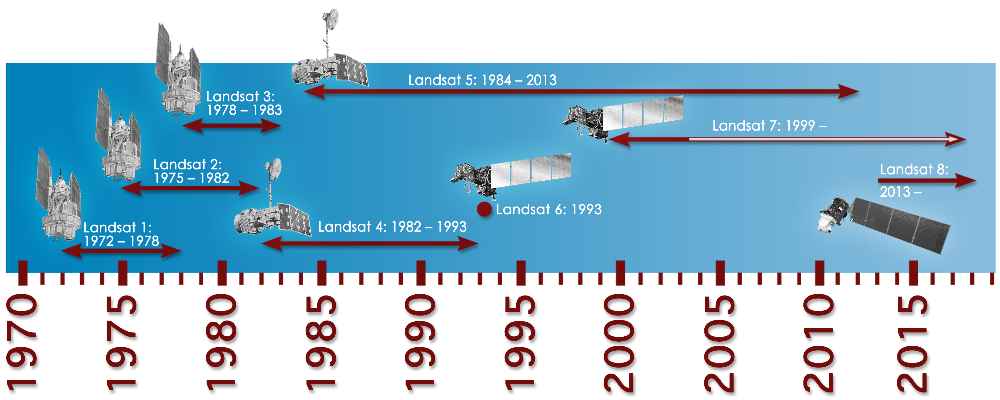

## Landsat 8

Operational Land Imager (OLI)

- "Pushbroom" sensor
- 12-bit radiometric resolution
- Cirrus cloud band!
- Small bandwidth changes in visible
- Very large changes in NIR and SWIR

##
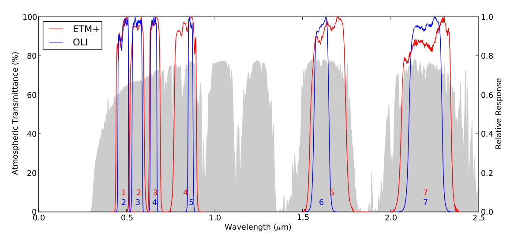

*Credit*: Flood, 2014

# Investigation

## Paper

Holden, Christopher E. and Curtis E. Woodcock. (In revision). An analysis of Landsat 7 and Landsat 8 underflight data and the implications for time series investigations. Remote Sensing of Environment

## Questions

1. **Do Landsat 7 and Landsat 8 spectral reflectances from CDR differ significantly? If so, what is the nature of the differences?**
2. **Are timeseries of Landsat 7 and Landsat 8 data different? What is the effect of combining the two sensors?**
3. What are the spectral characteristics of cloud and cirrus clouds masked by Landsat 8 but omitted in Landsat 7 data?
4. Are the cloud masking improvements in Landsat 8 apparent in timeseries?

## Sensor Differences

1. Measurement calibration
2. Atmospheric correction
    * TM/ETM+: LEDAPS
    * OLI: L8SR
3. Spectral response functions

# Landsat 8 "Underflight"

##

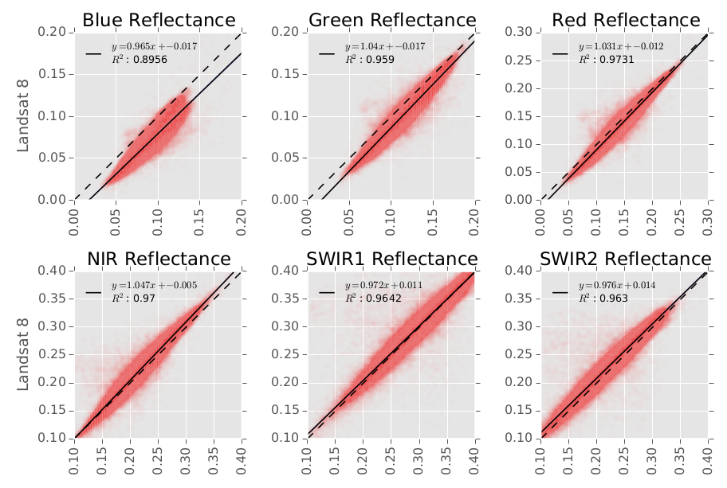

##

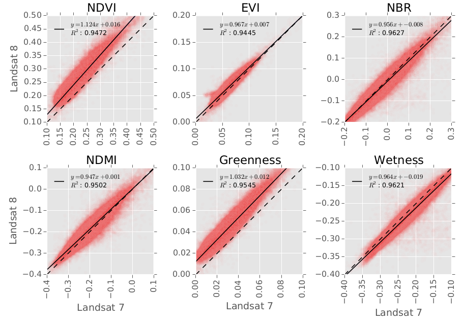

# Timeseries

## So there sensors look different...

1. Do the reflectance differences affect statistical modeling?
    * Intercept
    * Time trend slope
2. Do the differences in reflectance hinder our ability to find change?

## Continuous Change Detection and Classification (CCDC)

## CCDC

Timeseries analysis method for finding changes in land cover or land dynamics

1. Fit simple regression models to historical time period
2. Monitor for change in signal
    * Forecast model predictions
    * Monitor for change in forecast model residuals

## Forest Harvest and Regrowth

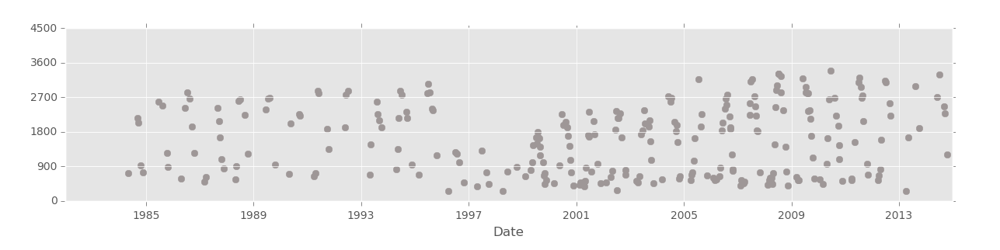

## CCDC

$$ \hat{\rho}_i = \beta_0 + \beta_1 x_i + \sum_{j \in{N}}[\beta_{2j}\cos(\frac{2\pi j}{T}x_i) + \beta_{2j+1}\sin(\frac{2\pi j}{T}x_i)] + e_i $$

- Intercept: Remove mean reflectance
- Slope: Remove time trend in reflectance
- Sin/Cosine: Remove seasonality in reflectance
- **Residual**: Our signal of interest!

##

##

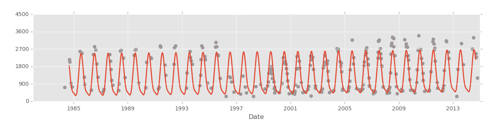

##

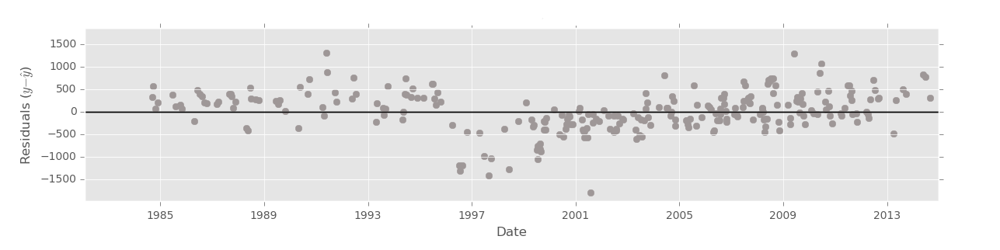

##

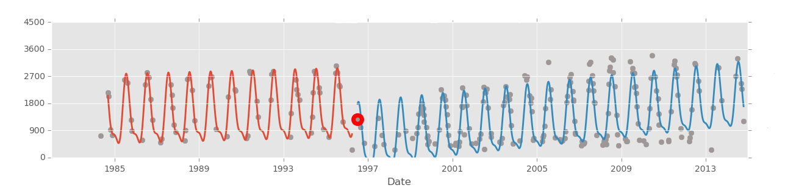

##

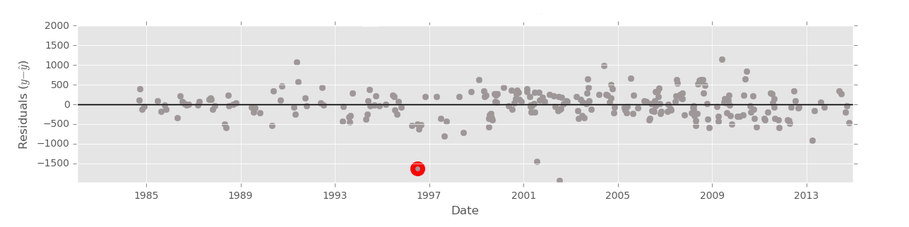

# Timeseries Results

## Test Framework

1. Collect Landsat 7 and Landsat 8 data
2. Run timeseries analysis using just Landsat 7
3. Run timeseries analysis with ONLY Landsat 8 after 2013
4. Run timeseries analysis with BOTH Landsat 7 and 8 after 2013
5. Compare model parameter estimates

##

$ Intercept_{LC8} $ / $ Intercept_{LE7} $

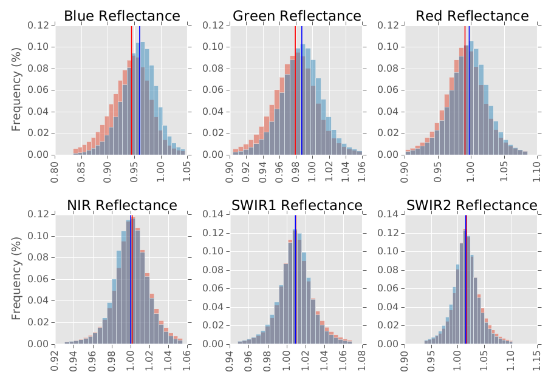

## Slope

$ Slope_{LC8} $ - $ Slope_{LE7} $

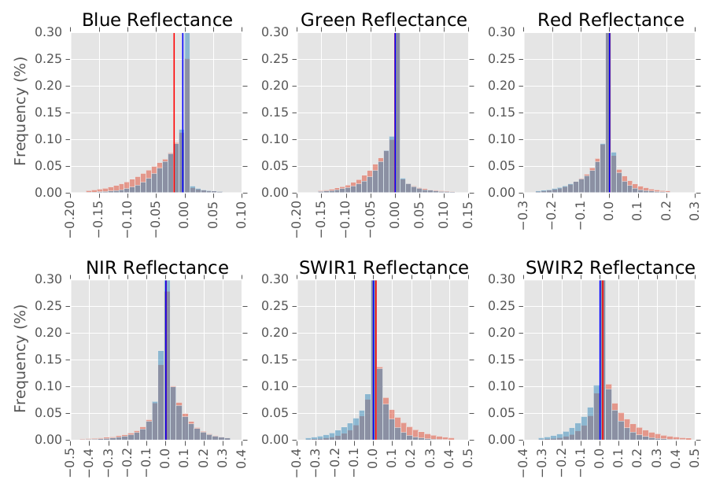

## RMSE

$ RMSE_{LC8} $ / $ RMSE_{LE7} $

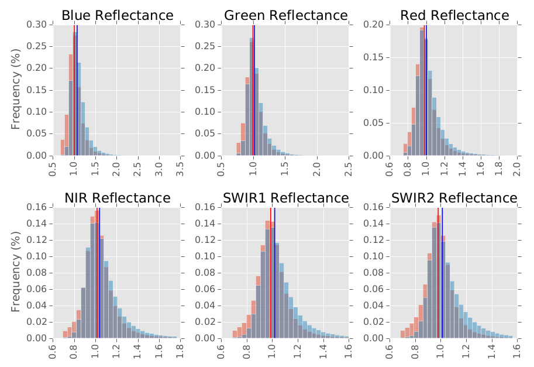

## Conclusions

1. Reflectance differences affect statistical modeling
    * Intercept
    * Time trend slope
2. Increase in unexplained variance (RMSE) hurts ability to find changes in reflectance

# A Simple Correction?

## Problem

- Sensor specific differences is left unexplained in regression model
- Sensor differences bias estimates of other model parameters
- Can we model the sensor differences?

## Dummy Variable

$$ \hat{\rho}_i = \beta_0 + \beta_1 x_i + \sum_{j \in{N}}[\beta_{2j}\cos(\frac{2\pi j}{T}x_i) + \beta_{2j+1}\sin(\frac{2\pi j}{T}x_i)] + C(sensor_i) + e_i $$

- Intercept: Subtract mean reflectance
- Slope: Remove time trend in reflectance
- Sin/Cosine: Remove seasonality in reflectance
- Dummy variable: Remove sensor specific difference
- **Residual**: Our signal of interest!

## Example

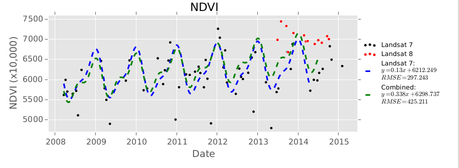

## Example

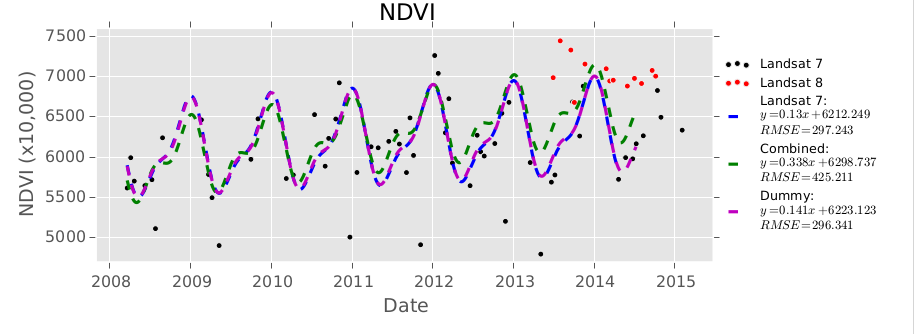

# Dummy Variable

##

What is being corrected in dummy variable?

1. Measurement calibration
2. Atmospheric correction
3. Spectral response functions

##

Dummy Variable Map

- Atmospheric correction:
    * dummy estimates should be equal across land cover type
- Spectral response function:
    * dummy variable will be a function of land cover type

##

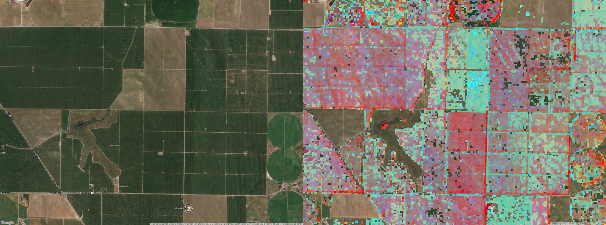

##

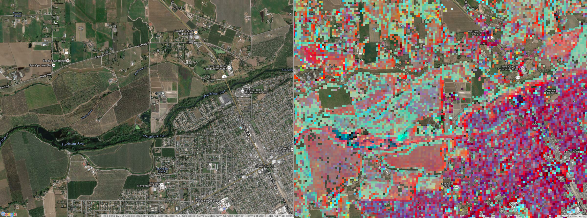

# Conclusions

##

1. Landsat 8 data are different enough to hinder timeseries analysis if left uncorrected
2. Statistical modeling of the sensor specific difference may help integrate Landsat 8
3. Relative contribution of atmospheric correction versus spectral response window is unknown
4. Dummy variable analysis suggests differences are target specific (uh oh!)
