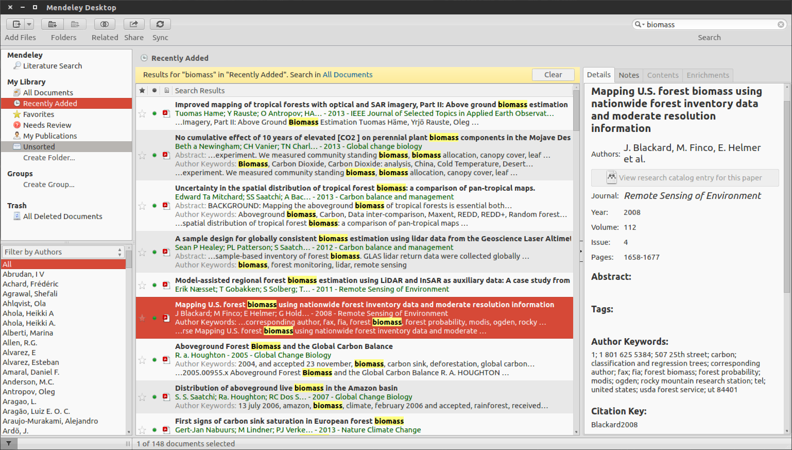

% Tip of the Week
% Tuesday, September 30, 2014

---

# Tip: Literature Organization

---

# Article and citation manager

---



---

# Writing Workflow:
1. Write in Markdown, LaTeX, or other that support BibTeX
2. Use BibTeX reference for citations
3. On export, bibliography is autogenerated from Mendeley exported BibTeX

---

# Write:

``` markdown
# Discussion
Let's suppose I'm writing a paper and need to cite someone [@Mitchard2013].

I can use equations:

$$ H_{lorey} = \frac{\sum_{i=1}^N {BA}_i h_i}{\sum_{i=1}^N {BA}_i} $$

# References

```

---

# Export


---

# Compile document to PDF or other

``` bash
pandoc --latex-engine xelatex \
        --bibliography=$HOME/Dropbox/Papers/library.bib \
        -o test.pdf test.md
```

---


---

Some references:

+ <http://daringfireball.net/projects/markdown/syntax>
+ <http://www.unexpected-vortices.com/sw/rippledoc/quick-markdown-example.html>
+ <http://savethevowels.org/essays/markdowndissertation.html>
+ <http://blog.yoavram.com/citations-in-markdown-using-pandoc/>

