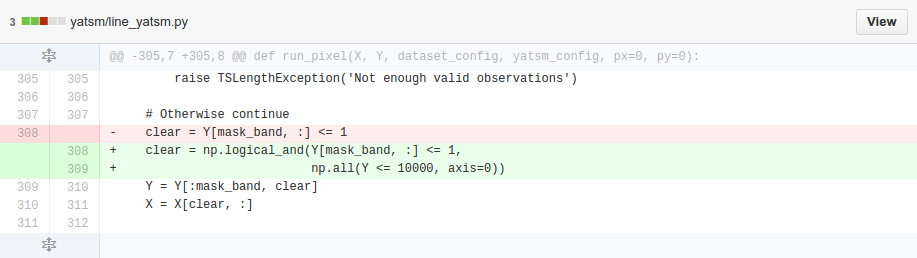

% Tip of the Week
% Tuesday, October 7th, 2014

# Source Code Revision Control

# Why?

## In general:

+ Document what changed
+ Document how it changed
+ Collaborative work
+ Permanent history of versions facilitates comparisons

## In practice:

+ Improved communication of changes with others
+ Synchronize your work across computers
+ Enables regression testing
+ Helps fix bugs faster
+ Easier than changelogs + diffs

# Semantic Versioning

## Example:

QGIS versions 1.8.0, 2.0.0, 2.0.1, and 2.4.0

+ MAJOR version changed from 1.X - 2.X and broke the existing API
+ MINOR version changed from 2.0 to 2.4 with new features added
+ PATCH version changed from 2.0.0 to 2.0.1 with bug fixes
+ See <http://semver.org/>

# Change Documentation
## Changelog:

+ Succinct description of what changed when
+ Long lists of changes
+ No information on what changed where and how

## Diffs and patches:

+ Shows how the code changed
    * Compare insertions and deletions
+ Links first version to current version - "delta-encoding"
+ Try in your terminal:
    * ```diff file_v1.txt file_v2.txt```
+ 

# Version Control Systems (VCS)
## Examples:

+ Git
+ Subversion (SVN)
+ Mercurial (hg)
+ Many, many more (please don't use CVS)

## Concept:


## Concept:

+ **Repository**: location of files and history, often on a server
+ **Working copy**: local copy of files from repository, at specific time or revision (where you do your new work)
+ **Commit**: write your changes in your local history, including how the code changed (diff) and why (changelog)
+ **Push**: send your local history to the repository, enabling it to be shared by others
+ **Pull** or **Update**: bring changes from the remote repository into your local working copy

# Git

## Description:

+ A very popular Distributed Version Control System used extensively in open source software (e.g., Linux kernel).
+ Getting started takes ~5 commands

## Clone

```
> git clone https://github.com/try-git/try_git.git
Cloning into 'try_git'...
warning: You appear to have cloned an empty repository.
Checking connectivity... done.
> cd try_git/
```

## Add

``` 
> echo "some work" > my_file.txt
> git add my_file.txt
```

## Status

``` 
> git status
On branch master

Initial commit

Changes to be committed:
  (use "git rm --cached <file>..." to unstage)

    new file:   my_file.txt
```

## Commit
```
> git commit -m "I did some work. Wow!"
 1 file changed, 1 insertion(+)
 create mode 100644 my_file.txt
```

## Log

```
> git log
commit 9e0e514d7b54e45d2d8667472376d125939a780a
Author: Chris Holden <ceholden@gmail.com>
Date:   Sun Oct 5 19:23:53 2014 -0400

    I did some work. Wow!
```

## Push

``` 
> git push origin master
```

# Git on SCC/GEO

## HTTPS

Because of some network firewall reasons, we cannot `pull` or `push` using HTTPS.

## SSH

Instead we have to use SSH:

* Generate a SSH key and passphrase
* Associate your SSH public key with your account on Github
* Switch your remote URL to the SSH link
* Full details: <https://help.github.com/categories/ssh/>

# Resources:

## Accounts

Github for education (free private repos for students): <https://education.github.com/>

## Tutorials
+ <https://try.github.io/> (AMAZING!)
+ <https://help.github.com/articles/what-are-other-good-resources-for-learning-git-and-github/>
+ <https://help.github.com/articles/set-up-git/>
+ <http://www.software-carpentry.org/v5/novice/git/index.html>
