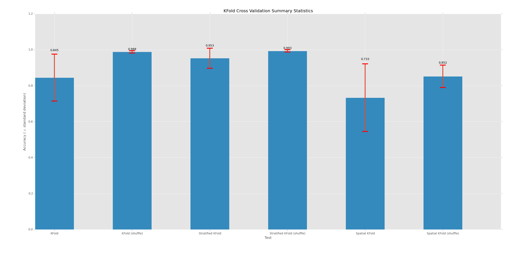

% Updates
% Tuesday, November 4th, 2014

---

# Algorithm

- Bugfix in multitemporal mask ([commit](https://github.com/ceholden/yatsm/commit/1d65bc5565039dd0bf35c09c57e058f3aea9940f))
- Parameterize multitemporal cloud screening threshold (Later this week) 
- Parameterize model update frequency in monitoring period (Later this week) 

---

# Batch interface

Option to cache entire rows of timeseries

- Profile:
    + 80 CPUs took 6-10 minutes each to read in 1 row initially
    + SCC/GEO cluster storage cache kicked in
    + ~80 took 15-60 seconds to read in 1 row
- Should speed up subsequent runs

---

# TSTools

- Approaching 1.0 release
    + Backend API changes
    + Bugfixes
    + No more features!
    + <https://github.com/ceholden/TSTools/issues?q=is%3Aopen+is%3Aissue+milestone%3A1.0>
- Live plotter for Python CCDC style algorithm now reads from cache
    + Near instantaneous read of every pixel in image
    + Can read saved model results 

---

# Classification

- Completed classifier training command line program
- Parameterize any classifier from [scikit-learn](http://scikit-learn.org/stable/supervised_learning.html#supervised-learning)
    + SVM
    + RandomForest
    + Logistic Regression
    + AdaBoost
    + Naive Bayes
- Built in KFold crossvalidation diagnostics

--- 

# Cross Validation

- Simple KFold crossvalidation is biased for training data patches
    + Spatial autocorrelation results in training / testing looking too similar
- Patch, or "spatial", KFold cross validation built

--- 

---

---
